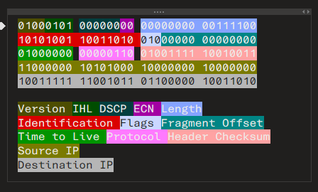

Packet Dissection is fairly simple. Each packet is 20 bytes, which encode information as this:

(This is the data from the challenge)

# Some Extra Details
- Checksum needs to be converted into Hexadecimal
- Time to Live needs to be converted into Decimal
- IPs are also converted to Decimal. It's four bytes, so convert the individual bytes into decimal numbers.

|Question|Raw Binary|"Converted" Answer|
|--------|----------|------------------|
|Checksum|01001111 10010011|4F93|
|Time to Live|01000000|64|
|Source IP|11000000 10101000 10000000 10000000|192.168.128.128|
|Destination IP|10011111 11001011	01100000 10011010|159.203.96.154|
